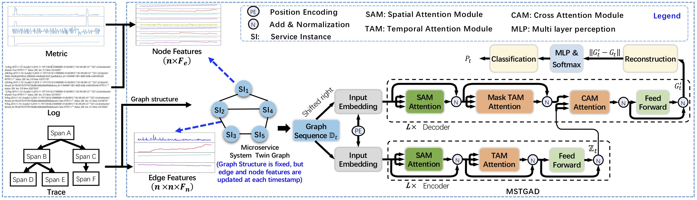

# **Twin Graph-based Anomaly Detection via Attentive Multi-Modal Learning for Microservice System**

This is the Pytorch implementation of MSTGAD in the ASE 2023: *Twin Graph-based Anomaly Detection via Attentive Multi-Modal Learning for Microservice System*

## Environment

The repository has some important dependencies below

* Ubuntu 18.04
* Python 3.8
* Pytorch 1.12.0
* Pytorch_geometric == 2.2.0

Install other dependencies can be installed by:

    pip install -r requirements.txt

## Dataset
The MSDS datasets  used in this paper can be downloaded from the [Multi-Source Distributed System Data for AI-powered Analytics | Zenodo](https://zenodo.org/record/3549604)

The other dataset that we don't have a permission to publish

The downloaded datasets can be put in the 'data' directory.  The directory structure looks like:

    ${CODE_ROOT}
        ......
        |-- data
            |-- MSDS
                |-- concurrent_data

## Training
To preprocess the data, run:

    python util/pre_MSDS.py

To start training, run:

    python main.py

## Architecture



## Citation

```latex
@inproceedings{Huang2023MSTGAD,
  author       = {Huang, Jun and Yang, Yang and Yu, Hang and Li,Jianguo and Zheng, Xiao},
  title        = {Twin Graph-based Anomaly Detection via Attentive Multi-Modal Learning for Microservice System},
  booktitle    = {38th {IEEE/ACM} International Conference on Automated Software Engineering, {ASE} 2023},
  year         = {2023},
}
```

## Contact

For any questions w.r.t. MSTGAD, please submit them to Github Issues .
